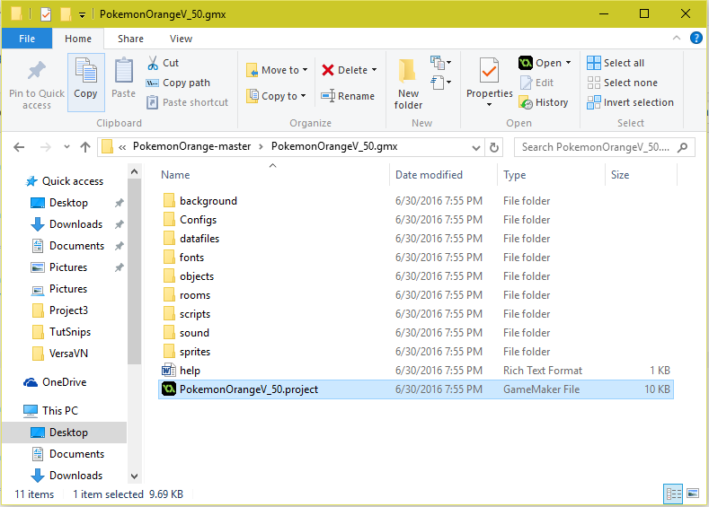

# Pokémon Orange
A Pokémon journey and personal project

## Introduction
This project was created for a team assignment during Game Design I, and it is an ongoing project. This project is based on the popular Pokémon series created by Game Freak Inc. It contains many of the same features as the original Pokémon games (see features below for a detailed list), but it also adds a more expansive multiplayer experience. Future updates will bring online multiplayer options to the game as well as a more complete experience.

## Installation Instructions
If you are only interested in playing the game during development skip to the <a href="#playerInstall">game install section</a>.
If you are interested in viewing or editing the project files, continue below.

### Game Maker Studio and Project Files
In order to view the project files you will need to install Game Maker Studio. The latest version of Game Maker Studio can be installed <a href="http://www.yoyogames.com/get">here</a>. Steps on how to install Game Maker Studio and system requirements can be found <a href="http://help.yoyogames.com/hc/en-us/articles/216753618-Installing-GameMaker-Studio">here</a>. If you are having problems during the installation of Game Maker Studio, you can submit a request for assistance <a href="http://help.yoyogames.com/hc/en-us/requests/new">here</a>.

Once you have completed installing Game Maker Studio, you may continue below.
<ol>
  <li>
    Download the archive from the github repository.
  </li>
  
  <li>
    Once the files have completed downloading, open PokemonOrange-master.zip. Extract the files to the location of your choice. It may be convenient to simply extract to your desktop.
  </li>
  <li>
    Locate the extracted folder, and open it. Double click the folder named "PokemonOrangeV_XX.gmx".
  </li>
  <li>
    Double click "PokemonOrangeV_XX.project".
  </li>
  
  <li>
    If you have done everything correctly, the project should open in Game Maker Studio! Thanks for the download!
  </li>
</ol>

<h3 id="playerInstall">Game Install</h3>
<ol>
  <li>
    Download the archive from the github repository.
  </li>
  
  <li>
    Once the files have completed downloading, open "PokemonOrange-master.zip". Extract the files to the location of your choice. It may be convenient to simply extract to your desktop.
  </li>
  <li>
    Locate the extracted folder, and open it. Double click "PokemonOrangeV_XX.exe".
  </li>
  
  <li>
    If a warning appears asking you to allow the app, choose "yes".
  </li>
  <li>
    If you agree to the license agreement, choose "I Agree".
  </li>
  
  <li>
    Select the components you would like to install, and click "Next".
  </li>
  <li>
    Choose the location where you would like to install the game files. Then, click "Install".
  </li>
  
  <li>
    Once the installation has completed, click "Next". You are finished! Thanks for downloading the game!
  </li>
</ol>
<strong>Note: If the file you download appears larger than you think it should be, you are correct! You have downloaded the project files as well as executable. I will change the location from which players download the game at a later date to avoid this concern. This is a temporary solution.</strong>

## Features
<ul>
  <li>
    Pokémon grow with their trainers! Train your Pokémon by battling against other trainers and wild Pokémon.
  </li>
  <li>
    Battle against other players on your local network! Only the very best will reign as the champion.
  </li>
  <li>
    Meet new Pokémon by capturing wild Pokémon or trading with other players on your local network!
  </li>
  <li>
    Experience your Pokémon journey with a friend! You never have to be alone with our new multiplayer mode.
  </li>
  <li>
    Chat with other trainers using the new messaging system!
  </li>
</ul>

### Upcoming Features
<ul>
  <li>
    Experience Pokémon like never before in online multiplayer. Battle, train, and explore in a new Pokémon world with anyone anywhere!
  </li>
  <li>
    Learn about new species of Pokémon and store their information in the Pokédex. Can you catch them all?
  </li>
  <li>
    Save your Pokémon journey in single player mode or multiplayer mode and load your game in the mode of your choice.
  </li>
</ul>
More features will be added as development progresses.

## Notes
The most difficult aspect of this project so far is creating smooth and exciting battles. This process is not yet complete. 

There were also slight complications with integrating local networking because noone on our team had experience creating multiplayer content. After fumbling with GML for a while, we were able to adapt to create this feature.

## Acknowledgements
Kris Nelson, Shay Madden, Richard Arredondo, and Braden Hearn are co-creators of this project.
